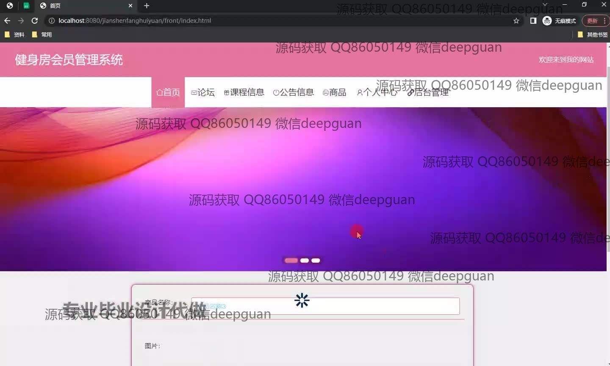

<h1 align="center">基于Vue的健身房会员管理系统+vue</h1>

## 简介
基于Vue的健身房会员管理系统：角色分为管理员、店长、教练和用户；包含论坛管理、课程信息管理、个人中心、公告信息管理、商品管理、课程订单管理和用户管理等功能模块。    --计算机毕业设计源码；毕设源码；java毕业设计源码

## 联系方式

<h3 align="center">获取完整代码与数据库文件 + 微信：deepguan QQ: 86050149 QQ群: 783742310</h3>

<h3 align="center">可帮忙远程部署 包运行成功！提供远程部署、修改代码、设计文档指导、代码讲解等服务！</h3>

## 功能介绍（完整见运行截图）
管理员：提供管理员、店长、教练和用户的角色选择，支持登录、注册和退出等基本功能。主页提供导航栏可访问首页、论坛、课程信息、公告信息、商品、个人中心和后台管理模块。具备用户管理，论坛管理，课程管理，公告管理，商品管理等功能模块，通过左侧导航栏进行模块切换。能够查看和编辑会员的详细信息、管理会员订单、课程安排和会员评价。可以新增或删除用户、课程、订单等信息，并提供相应的搜索和筛选功能以便于快速查询管理。提供多模块数据和信息统计接口，并实现相应的信息安全与权限管理。

用户：注册登录后进入系统主页，通过导航栏进入首页、论坛、课程信息、公告信息和商品模块。可以查看课程详情，论坛帖子，公告信息和各种商品，并进行在线互动和交流。个人中心允许用户查看和更新个人信息，包括联系方式、身份证号、邮箱、余额、积分等会员资料。用户可以在课程订单管理功能中查询个人课程订单信息，检视订单历史，管理课程的预约及评价功能。支持个人信息、地址、订单和收藏等资料的维护和管理，提供了账户充值和积分使用记录功能，满足会员日常健身房消费和信息管理需求。

## 运行截图

本代码来源于网络,仅供学习参考使用!

